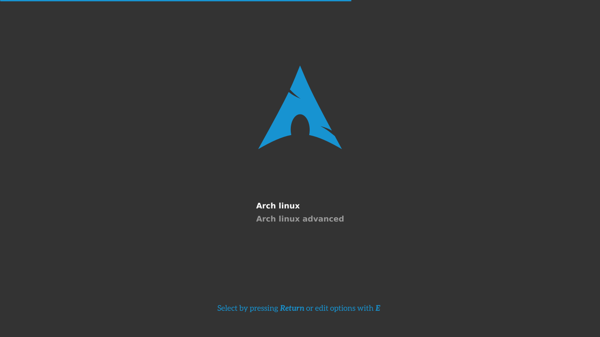

# Arch-Silence GRUB2 theme

My flat GRUB2 theme.

## Font

The font in the boot menu can't be changed because of GRUB.

GRUB does have a conversion tool from ttf to it's own format but this format encodes each pixel with 1 bit
which makes it completely useless since there's practically no font that is readable in such a low bit-depth.

## License

If not explicitly stated otherwise all the files in this project are distributed under the [GNU General Public License](./COPYING).

## Author

Filippo Ghibellini
